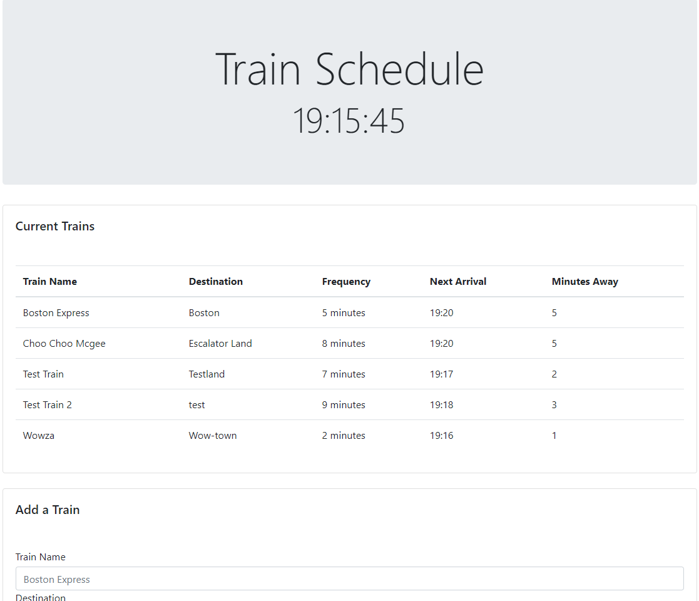
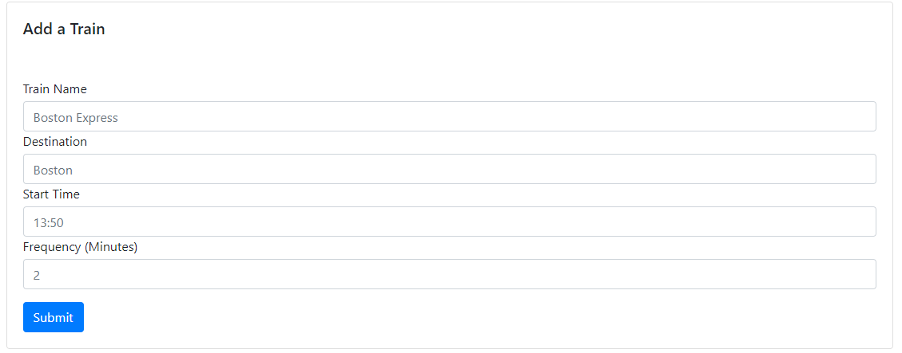

# TrainSchedule
An application that saves data using Google's FireBase.

At the top of the application is the current time.

Underneath you will find a table of the current trains in the database.

The table will tell you the name of the train, where it's heading, how frequently it arrives, what time it will arrive next, and how many minutes away it is.

The table will update in real time every minute.

To add a new train there is a form at the bottom:

Just add the name of the Train, It's Destination, what time is it's first arrival, and how frequently it arrives!
